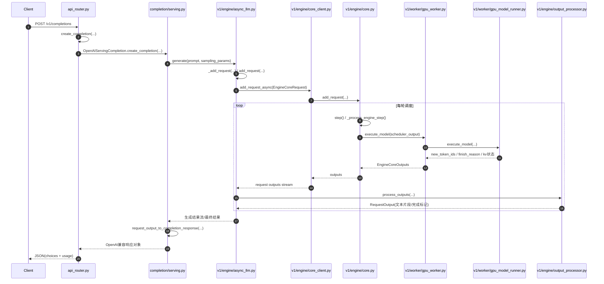

# vLLM 1.5B 推理函数级时序图（补充版）

> 基于本机实测链路（`/v1/completions`）+ vLLM 源码（v0.16.0，workspace 下 `vllm_repo`）整理。

## 1) 函数级时序图（主链路）

---

## 2) 关键函数定位（文件:行号）

### OpenAI 入口层
- `vllm/entrypoints/openai/completion/api_router.py:46`
  - `async def create_completion(...)`
- `vllm/entrypoints/openai/completion/serving.py:125`
  - `async def create_completion(...)`
- `vllm/entrypoints/openai/completion/serving.py:294`
  - `async def completion_stream_generator(...)`
- `vllm/entrypoints/openai/completion/serving.py:481`
  - `def request_output_to_completion_response(...)`

### 异步引擎层
- `vllm/v1/engine/async_llm.py:530`
  - `async def generate(...)`
- `vllm/v1/engine/async_llm.py:289`
  - `async def add_request(...)`
- `vllm/v1/engine/async_llm.py:406`
  - `async def _add_request(...)`

### Core Client / Core 调度层
- `vllm/v1/engine/core_client.py:213`
  - `async def add_request_async(...)`
- `vllm/v1/engine/core.py:292`
  - `def add_request(...)`
- `vllm/v1/engine/core.py:379`
  - `def step(...)`
- `vllm/v1/engine/core.py:1161`
  - `def _process_engine_step(...)`

### Worker 执行层
- `vllm/v1/worker/gpu_worker.py:659`
  - `def execute_model(...)`
- `vllm/v1/worker/gpu_model_runner.py:3378`
  - `def execute_model(...)`

### 输出处理层
- `vllm/v1/engine/output_processor.py:508`
  - `def add_request(...)`
- `vllm/v1/engine/output_processor.py:572`
  - `def process_outputs(...)`
- `vllm/v1/engine/output_processor.py:376`
  - `def _new_completion_output(...)`

---

## 3) 你关心的数据在每层怎么流

1. **API层**：文本 prompt + sampling params 进入。
2. **AsyncLLM**：封装成 `EngineCoreRequest`，进入异步队列。
3. **Core/Scheduler**：做 prefill/decode 调度，分配/复用 KV cache。
4. **GPU Worker/Runner**：执行前向，产出 `new_token_ids`。
5. **OutputProcessor**：detokenize + stop 检查 + usage 统计。
6. **Serving层**：组装 OpenAI JSON（`choices`,`usage`,`finish_reason`）返回。

---

## 4) 对定位性能问题最有用的观测点

- `core.py::step`：看调度节奏（是否等待/饥饿）
- `gpu_model_runner.py::execute_model`：看 prefill vs decode 计算压力
- `output_processor.py::process_outputs`：看流式输出节拍与结束条件
- 结合 runtime 日志：throughput、KV cache usage、prefix cache hit rate

---

## 5) 与本次实测的一致性

- 日志已验证实际链路可用（`/v1/completions` 返回 200）。
- 日志显示 `Asynchronous scheduling is enabled`，与 `async_llm -> core.step` 路径一致。
- 日志包含 `GPU KV cache size` 与 `Avg prompt/generation throughput`，与上述观测点一致。
